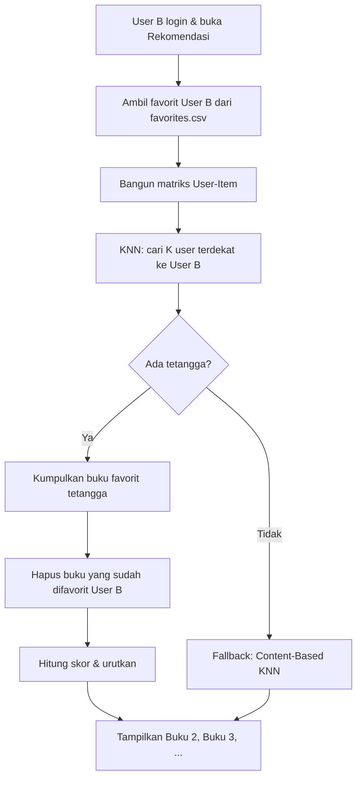

# Konsep Algoritma K-Nearest Neighbors (KNN)
## User-Based Collaborative Filtering pada OPAC Amikom

---

## 1. Tujuan Sistem

Sistem rekomendasi membantu pengguna menemukan buku yang **belum pernah mereka favoritkan**, berdasarkan pola interaksi pengguna lain yang **mirip** dengannya.

Metode utama: **User-Based Collaborative Filtering** dengan algoritma **K-Nearest Neighbors (KNN)**.

---

## 2. Skenario Utama (Contoh User A & User B)

### Data interaksi

| Pengguna | Favorit / Rating Tinggi |
|----------|-------------------------|
| **User A** | Buku 1, Buku 2, Buku 3 |
| **User B** | Buku 1 |

### Alur logika

```
User A  →  suka: [Buku 1, Buku 2, Buku 3]
User B  →  suka: [Buku 1]

Kemiripan: User A dan User B sama-sama menyukai Buku 1
           → vektor interaksi mereka "dekat" dalam ruang KNN

KNN menemukan: User A = tetangga terdekat (nearest neighbor) dari User B

Rekomendasi ke User B: Buku 2 dan Buku 3
           (disukai User A, belum ada di favorit User B)
```

### Ilustrasi

```
         Buku1  Buku2  Buku3  Buku4
User A     1      1      1      0
User B     1      0      0      0
User C     0      1      0      1

Jarak (cosine) User B ke User A  → KECIL  (mirip)
Jarak User B ke User C           → BESAR  (tidak mirip)

Tetangga User B: User A (K=1)
Rekomendasi untuk User B: Buku 2, Buku 3
```

---

## 3. Representasi Data

### 3.1 Matriks User–Item

Baris = **pengguna**, Kolom = **buku**, Nilai = **rating** atau **1/0** (favorit).

```
              Buku1   Buku2   Buku3   ...
User A          1       1       1
User B          1       0       0
User C          0       1       0
```

Di OPAC ini, sumber data: file `favorites.csv`  
Kolom: `username`, `judul_buku` → nilai favorit = **1**.

### 3.2 Vektor pengguna

Setiap user direpresentasikan sebagai vektor di ruang dimensi = jumlah buku:

- **User A** = `[1, 1, 1, 0, 0, ...]`
- **User B** = `[1, 0, 0, 0, 0, ...]`

KNN membandingkan vektor ini untuk mencari **K pengguna terdekat**.

---

## 4. Algoritma KNN (User-Based) — Langkah demi Langkah

### Input
- `target_user` = User B (yang akan menerima rekomendasi)
- `K` = jumlah tetangga terdekat (misalnya K = 3)
- Matriks user–item dari seluruh favorit

### Proses

| Langkah | Kegiatan |
|---------|----------|
| **1** | Bangun matriks user–item dari `favorites.csv` |
| **2** | Ambil vektor User B dari matriks |
| **3** | Hitung jarak/similarity User B ke semua user lain (cosine similarity) |
| **4** | Pilih **K user terdekat** (mis. User A) — ini **nearest neighbors** |
| **5** | Kumpulkan buku yang difavoritkan tetangga, **kecuali** buku yang sudah difavorit User B |
| **6** | Skor setiap buku = agregasi bobot dari tetangga (semakin dekat jaraknya, bobot semakin besar) |
| **7** | Urutkan buku berdasarkan skor tertinggi → **daftar rekomendasi** |

### Output
Daftar buku untuk User B, contoh: `[Buku 2, Buku 3, ...]`

---

## 5. Rumus Jarak (Cosine Similarity)

KNN diimplementasi dengan **jarak cosine** (di scikit-learn: `metric='cosine'`).

```
similarity(A, B) = (V_A · V_B) / (||V_A|| × ||V_B||)

jarak_cosine = 1 - similarity
```

- Semakin kecil jarak → semakin mirip pola favorit
- User A dan User B sama-sama punya Buku 1 → similarity tinggi

**Bobot rekomendasi** dari tetangga `u`:

```
bobot(u) = 1 - jarak_cosine(User_B, u)
```

Buku dari tetangga ditambahkan skornya sesuai bobot tersebut.

---

## 6. Perbedaan User-Based vs Item-Based

| Aspek | User-Based (konsep ini) | Item-Based |
|-------|-------------------------|------------|
| Yang dibandingkan | **Pengguna** dengan pengguna | **Buku** dengan buku |
| Pertanyaan | "Siapa user yang mirip saya?" | "Buku apa yang mirip buku ini?" |
| Rekomendasi | Buku yang disukai **tetangga user** | Buku yang mirip **buku yang disukai** |
| Skenario Anda | User A → rekomendasikan Buku 2,3 ke User B | Buku mirip Buku 1 |

**Sistem OPAC menggunakan User-Based** untuk rekomendasi personal (`Rekomendasi Untuk Anda`).

---

## 7. Diagram Alur Sistem



---

## 8. Contoh Numerik Lengkap

### Matriks favorit

| | Buku 1 | Buku 2 | Buku 3 |
|--|--------|--------|--------|
| User A | 1 | 1 | 1 |
| User B | 1 | 0 | 0 |
| User C | 0 | 0 | 1 |

### Untuk User B (K = 1)

1. Vektor B = `[1, 0, 0]`
2. Jarak ke A ≈ rendah (mirip karena sama-sama suka Buku 1)
3. Jarak ke C ≈ tinggi
4. Tetangga terdekat: **User A**
5. Favorit User A: Buku 1, 2, 3
6. User B sudah punya: Buku 1
7. **Rekomendasi: Buku 2, Buku 3**

---

## 9. Implementasi di Proyek OPAC

| File | Fungsi |
|------|--------|
| `favorites.csv` | Menyimpan interaksi user–buku |
| `opac_recommendation.py` | `knn_user_based()` — inti algoritma |
| `opac_recommendation.py` | `rekomendasi_untuk_anda()` — memanggil KNN user-based |
| `app.py` | Menampilkan section **Rekomendasi Untuk Anda** |

### Parameter yang dapat diatur

```python
K_NEIGHBORS = 3          # jumlah user terdekat
N_REKOMENDASI = 6        # jumlah buku yang ditampilkan
METRIC = "cosine"        # metrik jarak KNN
```

---

## 10. Syarat Agar KNN Berjalan Optimal

1. **Minimal 2 pengguna** dengan data favorit
2. **Minimal 1 buku yang sama** difavorit oleh 2 user berbeda (overlap)
3. Semakin banyak data favorit, semakin akurat tetangga terdekat

### Jika data belum cukup

Sistem menggunakan **fallback Content-Based KNN**: merekomendasikan buku dengan judul/pengarang/rak yang mirip dengan favorit user, berdasarkan TF-IDF.

---

## 11. Ringkasan Konsep

> **User-Based Collaborative Filtering + KNN** = mencari pengguna dengan pola favorit serupa, lalu merekomendasikan buku yang disukai tetangga tersebut tetapi belum pernah diinteraksi oleh user target.

Dengan skenario User A & User B: karena keduanya menyukai **Buku 1**, KNN menetapkan **User A sebagai nearest neighbor** dari **User B**, sehingga **Buku 2** dan **Buku 3** direkomendasikan ke User B.
